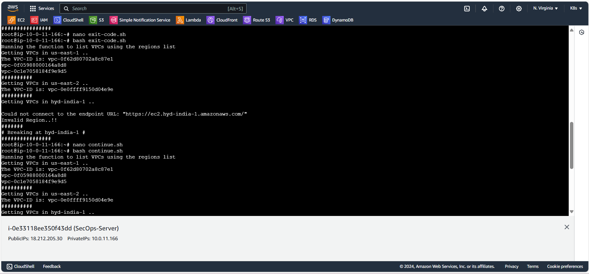

# Day-05 shell scripting

1. RegEx : We can use RegEx to search for specific patterns in a text. For example, finding dates, emails, phone numbers, or specific keywords.
2. Arrays: Array is nothing but list of components.
3. Break : The break command in shell scripting is important for controlling the flow of loops based on specific conditions.
4. Continue : In shell scripting, the continue command can be used to skip the current iteration of a loop and move on to the next iteration. which can effectively control the flow according to specific conditions.
5. Custom Exit Codes : Custom exit codes in shell scripts are used to indicate the success or failure of a script or command.

## 1. RegEx :

if [[ $USER =~ ^[a-zA-Z]+$ ]];
=~: Allows you to check if a string matches a given pattern.
^[a-zA-Z]+$ : is valid (only letters).
\d : The expression \d matches any one of the digits: 0, 1, 2, 3, 4, 5, 6, 7, 8, or 9.
\D : Identify names from a string that contains a mix of text and numbers.
\s : Is used to match any whitespace character. This includes spaces, tabs, and newlines.
\w : Is a helpful tool in RegEx that matches any letter, number, or underscore, making it great for working with text where you want to focus on valid "word-like" characters. 

-> nano regex.sh

#!/bin/bash
if [ $# -gt 0 ]; then
    for USER in $@; do
        echo $USER
        if [[ $USER =~ ^[a-zA-Z]+$ ]]; then
            EXISTING_USER=$(cat /etc/passwd | grep -i -w $USER | cut -d ':' -f1)
            if [ "${USER}" = "${EXISTING_USER}" ]; then
                echo "$USER is already exisitin, Please create a New user"
            else
                echo "Lets create the New $USER"
                sudo useradd -m $USER --shell /bin/bash
                SPEC=$(echo '!@#$%^&*()_' | fold -w1 | shuf | head -1)
                PASSWORD="IndianArmy@${RANDOM}${SPEC}"
                echo "$USER:$PASSWORD" | sudo chpasswd
                echo "The termporary password for the user is ${PASSWORD}"
                passwd -e $USER
            fi
        else
            echo "The User Must Contain Alphabets"
        fi
    done
else
    echo "Please pass the Argument"
fi

-> In regular expression we have mentioned only lower and uppercase letters that's the reason. The RegEx taking only lower and uppercase letters.

-> Now i can restrict the user along with the 3 letters and 3 numbers.
if [[ $USER =~ ^[a-z]{3}[0-9]{3}$ ]];

#!/bin/bash
if [ $# -gt 0 ]; then
    for USER in $@; do
        echo $USER
        if [[ $USER =~ ^[a-z]{3}[0-9]{3}$ ]]; then
            EXISTING_USER=$(cat /etc/passwd | grep -i -w $USER | cut -d ':' -f1)
            if [ "${USER}" = "${EXISTING_USER}" ]; then
                echo "$USER is already exisitin, Please create a New user"
            else
                echo "Lets create the New $USER"
                sudo useradd -m $USER --shell /bin/bash
                SPEC=$(echo '!@#$%^&*()_' | fold -w1 | shuf | head -1)
                PASSWORD="IndianArmy@${RANDOM}${SPEC}"
                echo "$USER:$PASSWORD" | sudo chpasswd
                echo "The termporary password for the user is ${PASSWORD}"
                passwd -e $USER
            fi
        else
            echo "The User Must Contain Alphabets"
        fi
    done
else
    echo "Please pass the Argument"
fi

2. Array: 
Example : We can take one variable and assign a value into the variable.
Name : 'surya prasad'
echo $Name

### Break, Exit Codes and Continue.

-> Now we can check for break

aws_regions=(us-east-1 us-east-2 hyd-india-1 eu-north-1 ap-south-1 eu-west-3 eu-west-2 eu-west-1 ap-northeast-2)

echo "Running the function to list VPCs using the regions list"

for region in "${aws_regions[@]}"; do
    echo "Getting VPCs in $region .. "
    vpc_list=$(aws ec2 describe-vpcs --region "$region" | jq -r .Vpcs[].VpcId)
    vpc_arr=(${vpc_list[@]})

    if [ ${#vpc_arr[@]} -gt 0 ]; then
        for vpc in "${vpc_list[@]}"; do
            echo "The VPC-ID is: $vpc"
        done
        echo "##########"
    else
        echo "Invalid Region..!!"
        echo "#######"
        echo "# Breaking at $region #"
        echo "################"
        break
    fi
done

-> Now we can check for exit 99 
######EXIT CODE############
#!/bin/bash
aws_regions=(us-east-1 us-east-2 hyd-india-1 eu-north-1 ap-south-1 eu-west-3 eu-west-2 eu-west-1 ap-northeast-2)

echo "Running the function to list VPCs using the regions list"

for region in "${aws_regions[@]}"; do
    echo "Getting VPCs in $region .. "
    vpc_list=$(aws ec2 describe-vpcs --region "$region" | jq -r .Vpcs[].VpcId)
    vpc_arr=(${vpc_list[@]})

    if [ ${#vpc_arr[@]} -gt 0 ]; then
        for vpc in "${vpc_list[@]}"; do
            echo "The VPC-ID is: $vpc"
        done
        echo "##########"
    else
        echo "Invalid Region..!!"
        echo "#######"
        echo "# Breaking at $region #"
        echo "################"
        #break
        exit 99
    fi
done

-> Now we can check for Continue.

# CONTINUE

#!/bin/bash
aws_regions=(us-east-1 us-east-2 hyd-india-1 eu-north-1 ap-south-1 eu-west-3 eu-west-2 eu-west-1 ap-northeast-2)

echo "Running the function to list VPCs using the regions list"

for region in "${aws_regions[@]}"; do
    echo "Getting VPCs in $region .. "
    vpc_list=$(aws ec2 describe-vpcs --region "$region" | jq -r .Vpcs[].VpcId)
    vpc_arr=(${vpc_list[@]})

    if [ ${#vpc_arr[@]} -gt 0 ]; then
        for vpc in "${vpc_list[@]}"; do
            echo "The VPC-ID is: $vpc"
        done
        echo "##########"
    else
        echo "Invalid Region..!!"
        echo "#######"
        echo "# Breaking at $region #"
        echo "################"
        #break
        #exit 99
        continue
    fi
done

